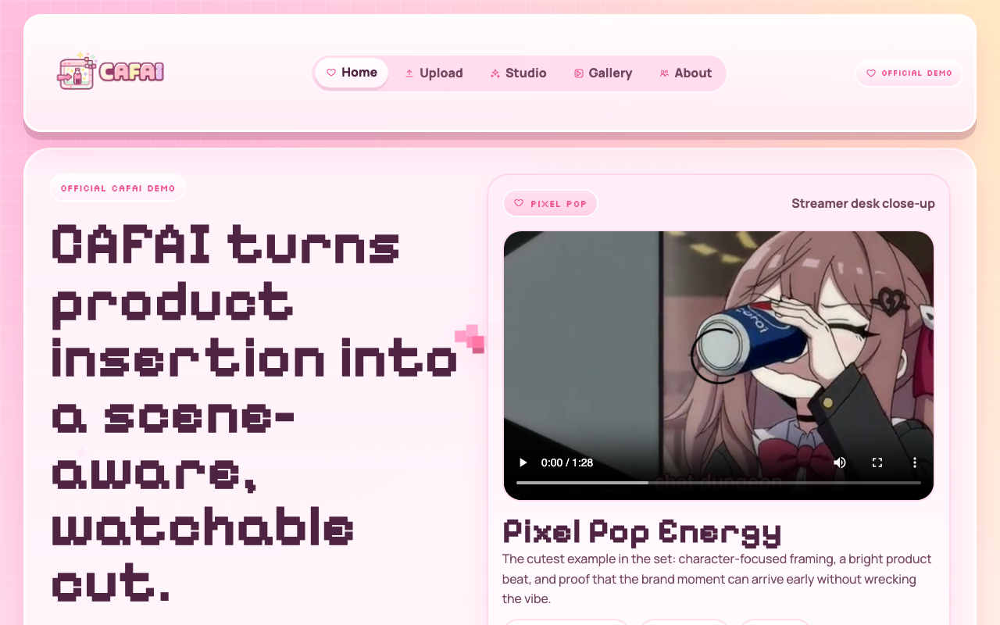
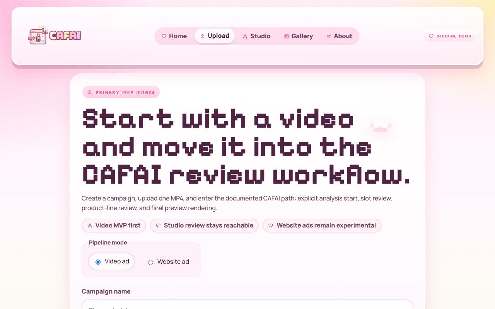
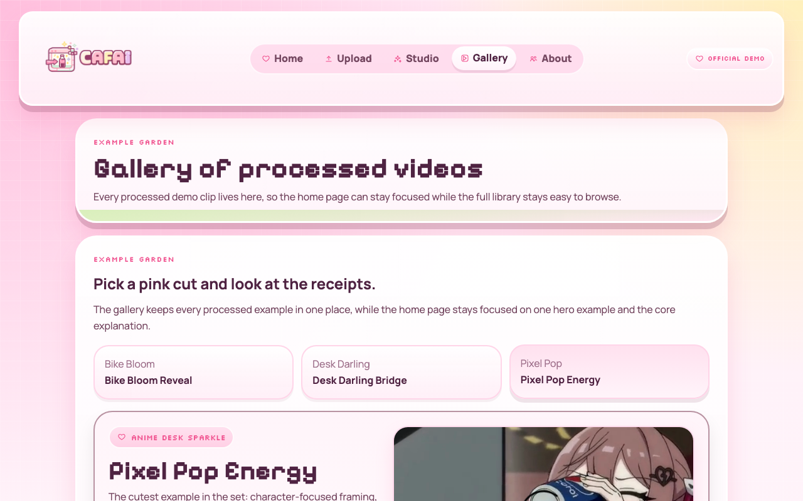
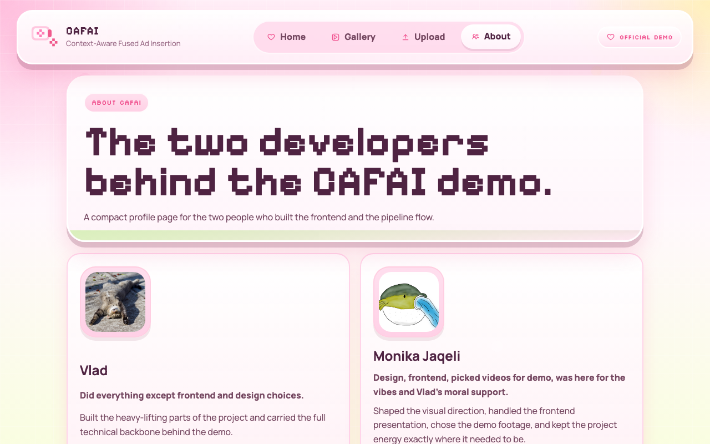
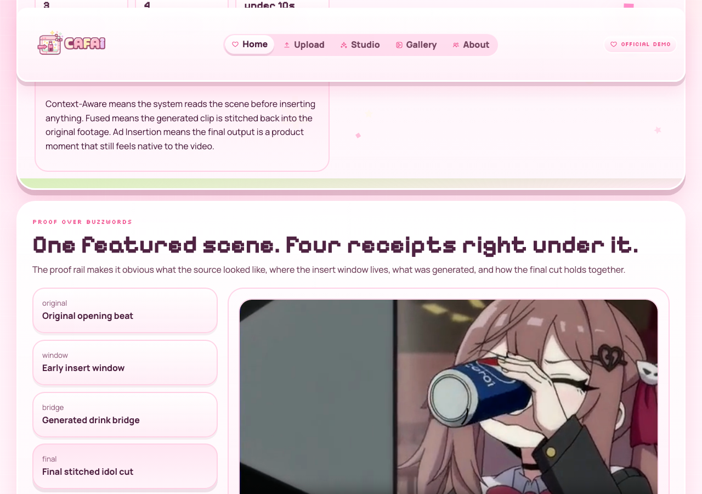
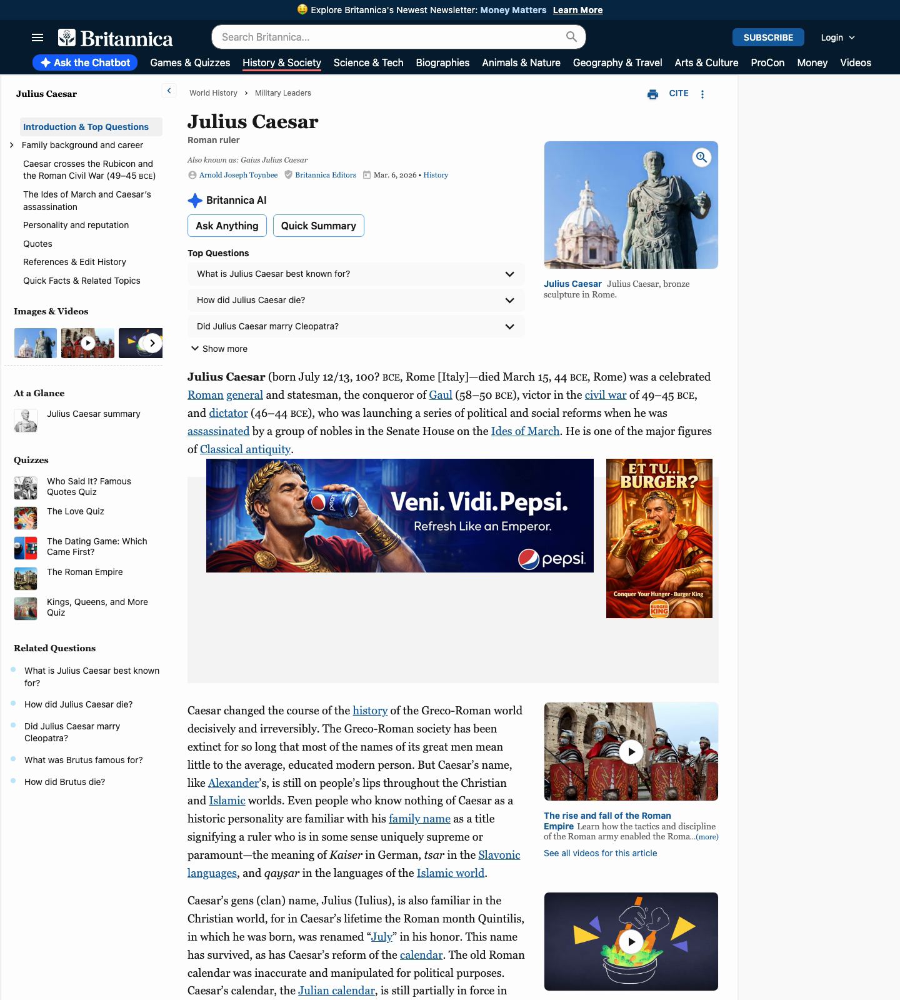
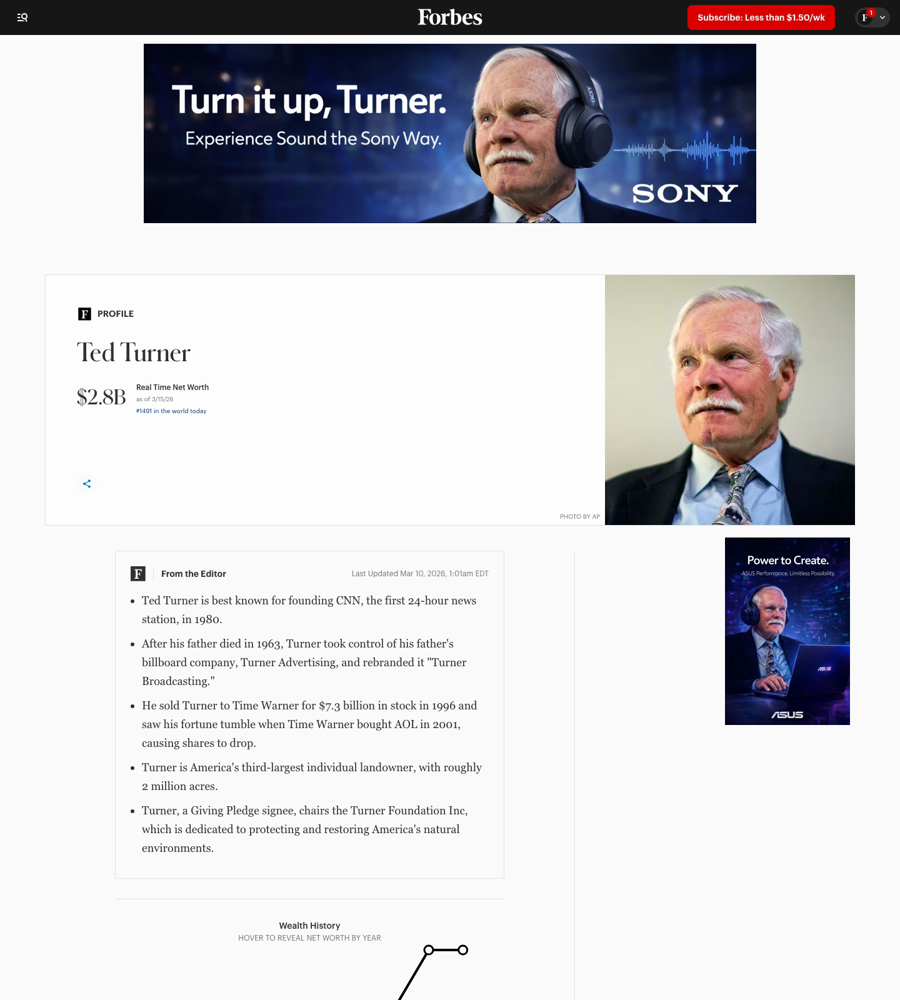
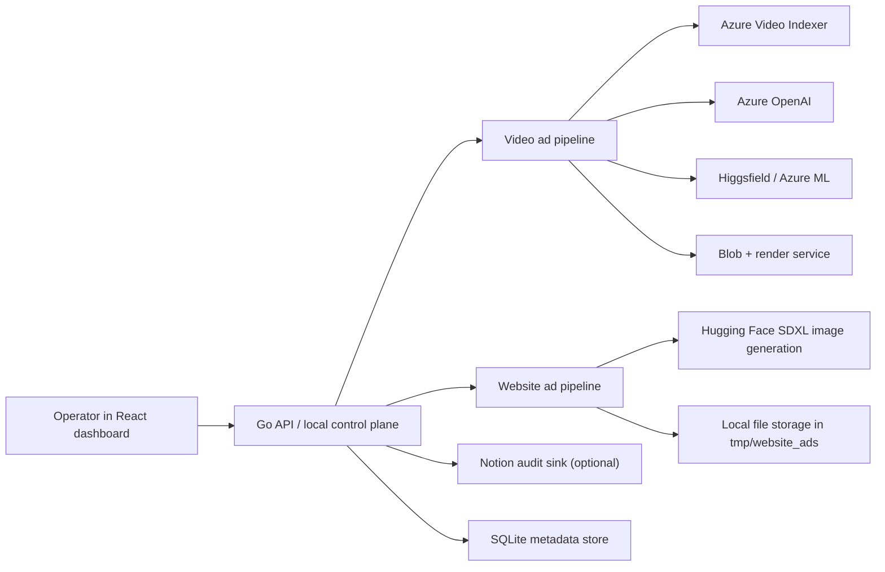

<div align="center">


# CAFAI
### Context-Aware Fused Ad Insertion

*Your creative companion for seamless, intelligent ad integrations*

[](https://mlh.io)
[](https://golang.org)
[](https://react.dev)
[](https://www.typescriptlang.org)

---

</div>

<div align="center">


</div>

## What It Does

CAFAI is an operator-driven creative generation workflow with two powerful lanes:

### Video Ad Lane
Transform your videos with intelligent branded moments:
- Upload a product and source video  
- Analyze the video for perfect insertion windows
- Select an automatic slot or manually override it
- Generate a short branded bridge clip
- Stitch the clip back into your footage
- Export a beautiful downloadable preview MP4

### Website Ad Lane  
Create stunning ads from article context:
- Choose a saved product or create one inline
- Paste your article headline and content
- Choose a visual direction
- Generate banner and vertical ads
- Review outputs in real-time gallery
- Go live instantly

## Tech Stack

CAFAI combines best-of-breed tools across multiple domains:

<table align="center">
<tr>
<td align="center">

**Frontend**  
React + TypeScript  
Vite + TailwindCSS
</td>
<td align="center">

**Backend**  
Go REST API  
SQLite + Worker
</td>
<td align="center">

**AI/ML**  
Azure Video Indexer  
Azure OpenAI  
Higgsfield Kling
</td>
</tr>
<tr>
<td align="center">

**Generation**  
Hugging Face SDXL  
Azure ML Fallback
</td>
<td align="center">

**Storage**  
Azure Blob Storage  
Local Filesystem
</td>
<td align="center">

**Audit**  
Notion MCP (Optional)  
Real-time Logging
</td>
</tr>
</table>

---

## How Website Ads Work

<div align="center">

### Dashboard Showcase

| Home | Upload | Gallery |
|------|--------|---------|
|  |  |  |

| About | Proof Room |
|-------|-----------|
|  |  |

</div>

### Website Ads Showcase

Bringing articles to life with AI-generated ads:

<table align="center">
<tr>
<td align="center" width="33%">

**Britannica / Julius Caesar**  

</td>
<td align="center" width="33%">

**Forbes / Ted Turner**  

</td>
<td align="center" width="33%">

**Education About Asia / Demon Slayer**  

</td>
</tr>
</table>

---

## Video Ad Results

Three polished examples showcasing our engine's capabilities:

### Featured: Pixel Pop Energy
*Streamer close-up with an early energy-drink insert. The branded moment lands right after the opening beat.*

<table align="center">
<tr>
<td align="center">

**Final Stitched Preview**  
[Play Video](frontend/public/demo/example3-final.mp4)
</td>
<td align="center">

**Generated Bridge**  

</td>
</tr>
</table>

**Metrics:**
- Source: 82.2s → Preview: 88.5s
- Insert Window: 7.9s → 8.6s  
- Anchor Frames: 237 → 259

### Bike Bloom Reveal
*Outdoor bicycle sequence with a late-scene handoff.*

<table align="center">
<tr>
<td align="center">

**Final Stitched Preview**  
[Play Video](frontend/public/demo/example1-final.mp4)
</td>
<td align="center">

**Generated Bridge**  

</td>
</tr>
</table>

**Metrics:**
- Source: 59.5s → Preview: 64.5s
- Insert Window: 41.7s → 43.4s
- Anchor Frames: 1250 → 1300

### Desk Darling Bridge  
*Desk-side talking head with a seamless branded bridge.*

<table align="center">
<tr>
<td align="center">

**Final Stitched Preview**  
[Play Video](frontend/public/demo/example2-final.mp4)
</td>
<td align="center">

**Generated Bridge**  

</td>
</tr>
</table>

**Metrics:**
- Source: 59.0s → Preview: 65.5s
- Insert Window: 20.5s → 21.0s
- Anchor Frames: 615 → 630

---

The shipped website-ads flow is synchronous and intentionally simple:

1. the frontend sends `product_id` or inline product data, `article_headline`, `article_body`, and `brand_style` to `POST /api/website-ads`
2. the backend validates the payload and resolves the product if a saved product was selected
3. `WebsiteAdService` builds one base prompt from the article and product context
4. the image client calls Hugging Face routed inference twice: once for a banner and once for a vertical unit
5. generated files are saved under `tmp/website_ads`
6. the job record is stored in SQLite and returned with asset URLs for banner and vertical delivery

Current API surface for this lane:

- `POST /api/website-ads`
- `GET /api/website-ads`
- `GET /api/website-ads/{job_id}`
- `GET /api/website-ads/{job_id}/assets/banner`
- `GET /api/website-ads/{job_id}/assets/vertical`

Current implementation notes:

- this is a real backend path, not just a static frontend mock
- generation currently depends on `HUGGINGFACE_API_TOKEN`
- the default image model is `stabilityai/stable-diffusion-xl-base-1.0`
- the injected placement previews in `frontend/public/website-ads` are demo artifacts used to show how those ads could appear on captured pages

## Hackathon Demo Flow

The strongest demo path combines both lanes:

1. show the homepage and gallery proofs for the stitched-video pipeline
2. switch to the upload page and show the `Video Ad` / `Website Ad` toggle
3. run one website-ad job from article context
4. open the website ads gallery to compare generated assets with the injected page examples
5. open a video job and walk through analysis, slot selection, generation, and preview evidence

Video-path recovery flow still supported:

1. generate the bridge clip outside the app
2. call `POST /api/jobs/{job_id}/slots/manual-import`
3. mark that slot as `generated`
4. continue through the normal preview render flow

## Validation Assets

The repo includes a concrete validation package under [phase4-validation](phase4-validation).

### Structure

Each example lives under `phase4-validation/input/ExampleN/` and `phase4-validation/output/ExampleN/`:

| Example | Product | Source video | Generated bridge | Final preview |
|---------|---------|--------------|------------------|---------------|
| Example 1 | [product.jpg](phase4-validation/input/Example1/product/product.jpg) | [phase4_test_59s.mp4](phase4-validation/input/Example1/video/phase4_test_59s.mp4) | [hf_...mp4](phase4-validation/output/Example1/video/hf_20260314_191119_ba726ac9-6ed2-4ac1-b9e1-696055d5e81f.mp4) | [manual_import_preview_api.mp4](phase4-validation/output/Example1/manual_import_preview_api.mp4) |
| Example 2 | [product.jpg](phase4-validation/input/Example2/product/product.jpg) | [example2_59s.mp4](phase4-validation/input/Example2/video/example2_59s.mp4) | [hf_...mp4](phase4-validation/output/Example2/video/hf_20260314_200445_73beb1a5-504f-4ac7-b174-ca69a5bc66a2.mp4) | [manual_import_preview_api.mp4](phase4-validation/output/Example2/manual_import_preview_api.mp4) |
| Example 3 | [product.jpg](phase4-validation/input/Example3/product/product.jpg) | [videoplayback (1).mp4](phase4-validation/input/Example3/video/videoplayback%20(1).mp4) | [hf_...mp4](phase4-validation/output/Example3/video/hf_20260315_053749_592fecd7-ff36-4beb-acba-170ce0f16107.mp4) | — |

### Anchor frames

- Example 1: [start-frame.png](phase4-validation/output/Example1/start-stop-frames/start-frame.png), [stop-frame.png](phase4-validation/output/Example1/start-stop-frames/stop-frame.png)
- Example 2: [start-frame.png](phase4-validation/output/Example2/start-stop-frames/start-frame.png), [stop-frame.png](phase4-validation/output/Example2/start-stop-frames/stop-frame.png)
- Example 3: [1.png](phase4-validation/output/Example3/start-stop-frames/1.png), [2.png](phase4-validation/output/Example3/start-stop-frames/2.png)

### Product metadata

All examples use [metadata.json](phase4-validation/input/Example1/product/metadata.json) (Pepsi Cola).

## Current Status

Implemented now:

- Phase 0: foundation and runtime bootstrap
- Phase 1: product and campaign ingest
- Phase 2: explicit analysis start, worker polling, scene persistence, slot review, reject, and re-pick
- Phase 3: slot selection, manual slot override, Russian-aware generation inputs, provider-aware caching, Higgsfield-primary generation, Azure ML fallback wiring, and manual generated-clip import
- Phase 4: preview render start, render polling, preview persistence, streaming, and download
- Phase 5 subset: article-driven website ad creation, local asset persistence, website ad gallery routes, and main-site showcase integration

Practical current state:

- the local control plane works
- automated backend and frontend tests pass
- the short validation flow works through analysis and slot selection
- manual generated MP4 import works and is part of the backend API
- final preview stitching can be completed locally
- website ad generation works when a Hugging Face token is configured
- optional Notion MCP integration logs job transitions and operator actions in real time

Intentionally deferred:

- async website-ad job execution and polling
- richer article ingestion such as URL fetch/extraction
- production-grade provider failover and quota handling
- broader Phase 5 automation and ZIP/export workflows

## Architecture At A Glance

- React dashboard for the operator workflow
- Go REST API as the local control plane
- SQLite as the metadata store
- local filesystem for uploads, debug artifacts, cache, previews, and website-ad assets
- polling worker as the MVP async mechanism for the video path
- Azure Video Indexer + Azure OpenAI for video analysis and ranking
- Higgsfield Kling as primary media generation for video inserts
- Azure ML retained as fallback video generation path
- Hugging Face text-to-image inference for website-ad generation
- Azure Blob Storage + render service for cloud stitching
- optional Notion audit sink for cross-phase timeline visibility and run reporting



Canonical job flow for video ads:

1. create or select a product
2. create a campaign and upload the source video
3. explicitly start analysis
4. review proposed insertion slots
5. select a proposed slot or manually enter a slot window
6. review or edit the product line
7. generate a CAFAI bridge clip
8. render one preview MP4
9. download the final preview from local storage

Canonical flow for website ads:

1. open the upload page
2. switch to `Website Ad`
3. choose a saved product or enter a product inline
4. supply article headline and article body
5. choose a visual style
6. submit and wait for banner + vertical image generation
7. review assets through the website ads gallery routes

## API Surface

Base path: `/api`

Live route groups:

- health: `GET /api/health`
- products: `POST /api/products`, `GET /api/products`
- campaigns: `POST /api/campaigns`, `GET /api/campaigns/{campaign_id}`
- jobs: `GET /api/jobs/{job_id}`, `GET /api/jobs/{job_id}/logs`
- analysis: `POST /api/jobs/{job_id}/start-analysis`
- slots: list, detail, select, manual-select, manual-import, reject, re-pick, and generate under `/api/jobs/{job_id}/slots`
- preview: render, status, stream, and download under `/api/jobs/{job_id}/preview`
- website ads: create, list, detail, and asset streaming under `/api/website-ads`

Standard API errors use one envelope:

- `error`
- `error_code`
- `http_status`
- `details`
- `timestamp`

## Repository Layout

Important paths:

- `backend/cmd/server`: Go server entrypoint
- `backend/internal/api`: HTTP handlers and router
- `backend/internal/db`: SQLite access and migration bootstrap
- `backend/internal/models`: domain structs mirroring API and schema concepts
- `backend/internal/services`: provider clients, artifact helpers, generation, render, manual import logic, website ads, and audit logging
- `backend/internal/worker`: polling worker
- `backend/scripts/migrations`: executable SQL migrations
- `backend/docs/NOTION_MCP_INTEGRATION.md`: Notion audit setup and behavior
- `backend/docs/WEBSITE_ADS_FEATURE.md`: shipped website ad architecture and operator flow
- `frontend/src/pages`: dashboard pages
- `frontend/src/content/demoContent.ts`: video demo examples metadata
- `frontend/src/content/websiteAdsContent.ts`: static website ad examples metadata
- `frontend/public/demo`: demo videos, GIFs, posters, frames
- `frontend/public/website-ads`: captured-page previews and static injected examples
- `phase4-validation/`: video demo assets, provider outputs, and stitched results
- `tmp/`: local runtime databases, artifacts, cache, previews, and debug output

## Development

Prerequisites:

- Go `1.25+`
- `ffmpeg` and `ffprobe` on `PATH`
- Node.js + npm

macOS install:

```bash
brew install ffmpeg
```

Backend:

```bash
go run ./backend/cmd/server
```

Backend tests:

```bash
cd backend
go test ./...
```

Frontend:

```bash
cd frontend
npm install
npm run dev
```

Frontend tests:

```bash
cd frontend
npm run test
```

Frontend production build:

```bash
cd frontend
npm run build
```

## Runtime Requirements

- Phase 2, 3, and 4 require provider configuration before backend startup
- local `ffmpeg` is required for anchor extraction and local stitch fallback
- when `HIGGSFIELD_API_KEY` and `HIGGSFIELD_API_SECRET` are set, Phase 3 generation tries Higgsfield first
- Azure ML remains the fallback video generation provider
- preview rendering still expects blob/render provider configuration
- website ad generation expects `HUGGINGFACE_API_TOKEN`
- `HUGGINGFACE_IMAGE_MODEL` defaults to `stabilityai/stable-diffusion-xl-base-1.0`
- local SQLite, local uploads, and local output folders remain part of the MVP control plane
- if Notion audit env vars are configured, startup validates database connectivity and `/api/health` reports audit status

## Notion MCP Audit Mode

The repository supports an operator-friendly Notion audit mode for the video and website-ad workflows.

What it does:

- mirrors important job transitions into a Jobs database
- appends granular operator and worker actions into an Events database
- exposes audit health through `GET /api/health`
- lets the frontend link operators to a Notion dashboard when `VITE_NOTION_DASHBOARD_URL` is set

Minimum setup:

1. configure Notion env vars: `NOTION_API_KEY`, `NOTION_JOBS_DATABASE_ID`, `NOTION_EVENTS_DATABASE_ID`
2. optionally set frontend `VITE_NOTION_DASHBOARD_URL`
3. run the helper checklist:

```bash
./backend/scripts/notion_mcp_bootstrap.sh
```

Health output includes audit status:

```bash
curl -s http://localhost:8080/api/health
```

See the full setup guide in [backend/docs/NOTION_MCP_INTEGRATION.md](backend/docs/NOTION_MCP_INTEGRATION.md).

## Documentation

Core engineering docs live in [absolute-documents](absolute-documents).

Implementation guides:

- [backend/docs/NOTION_MCP_INTEGRATION.md](backend/docs/NOTION_MCP_INTEGRATION.md)
- [backend/docs/WEBSITE_ADS_FEATURE.md](backend/docs/WEBSITE_ADS_FEATURE.md)

Design and architecture docs:

1. [01_Product_Design_Document.md](absolute-documents/01_Product_Design_Document.md)
2. [02_System_Architecture_Document.md](absolute-documents/02_System_Architecture_Document.md)
3. [03_Technical_Specifications.md](absolute-documents/03_Technical_Specifications.md)
4. [04_Repository_Structure.md](absolute-documents/04_Repository_Structure.md)
5. [06_API_Contracts.md](absolute-documents/06_API_Contracts.md)
6. [07_Data_Schema_Definitions.md](absolute-documents/07_Data_Schema_Definitions.md)
7. [08_Task_Decomposition_Plan.md](absolute-documents/08_Task_Decomposition_Plan.md)
8. [09_Figma_Software_Page_Brief.md](absolute-documents/09_Figma_Software_Page_Brief.md)

Website-ad design set:

1. [phase5-website-ads/00_README.md](absolute-documents/phase5-website-ads/00_README.md)
2. [phase5-website-ads/01_Product_Design_Document.md](absolute-documents/phase5-website-ads/01_Product_Design_Document.md)
3. [phase5-website-ads/02_System_Architecture_Document.md](absolute-documents/phase5-website-ads/02_System_Architecture_Document.md)
4. [phase5-website-ads/03_Technical_Specifications.md](absolute-documents/phase5-website-ads/03_Technical_Specifications.md)

## Documentation Notes

- the `absolute-documents/phase5-website-ads` folder still describes the broader design target
- `backend/docs/WEBSITE_ADS_FEATURE.md` describes the shipped subset that exists in code today
- `backend/docs/NOTION_MCP_INTEGRATION.md` covers the actual operator setup for audit visibility
