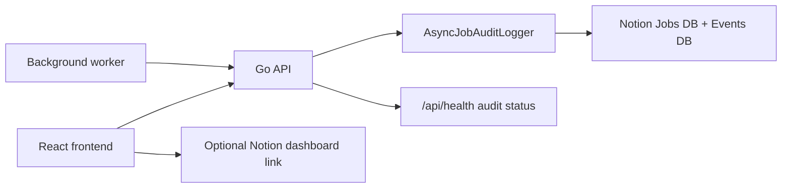

# Notion MCP Audit Integration

## Purpose

CAFAI can mirror pipeline activity into Notion so operators have a simple audit workspace outside the app.

In practice, this gives the team:

- one Jobs database for the latest status of each job
- one Events database for the full event timeline
- a dashboard target that can be linked from the frontend
- health visibility from the backend without blocking media processing

This integration is optional. If the Notion environment variables are not configured, the application continues to run normally.

## What "Notion MCP" Means Here

Within this repo, "Notion MCP" refers to the challenge/demo workflow of sending CAFAI job telemetry into Notion so the workspace behaves like an operator-facing control room.

The current implementation uses Notion's HTTP API directly from the backend:

- `NotionAuditLogger` writes audit data
- `AsyncJobAuditLogger` buffers and retries writes
- frontend pages can expose a direct dashboard link through `VITE_NOTION_DASHBOARD_URL`

So the important behavior is the mirrored audit trail, not a separate standalone MCP server inside this repository.

## Data Model

Create two databases in Notion and share them with your integration token.

### Jobs database

This is the latest-state view for each CAFAI job.

Required properties:

- `Name` (title)
- `Job ID` (rich text)
- `Campaign ID` (rich text)
- `Status` (rich text)
- `Current Stage` (rich text)
- `Last Event` (rich text)
- `Error Code` (rich text)
- `Updated At` (date)
- `Summary` (rich text)

Recommended usage:

- sort by `Updated At`
- group by `Status` or `Current Stage`
- add filtered views for failed jobs and active jobs

### Events database

This is the append-only audit stream.

Required properties:

- `Event` (title)
- `Job ID` (rich text)
- `Campaign ID` (rich text)
- `Event Type` (rich text)
- `Status` (rich text)
- `Current Stage` (rich text)
- `Error Code` (rich text)
- `Timestamp` (date)
- `Message` (rich text)
- `Metadata` (rich text)

Recommended usage:

- sort by `Timestamp` descending
- add filters for one job ID during a demo
- keep a failure-focused view filtered by non-empty `Error Code`

## What Gets Logged

The audit sink is designed to track both worker-driven and operator-driven actions.

Currently logged categories:

- analysis lifecycle transitions
- slot review and slot selection actions
- slot rejection and re-pick actions
- generation start and completion events
- preview render start and completion events
- manual generation import actions
- terminal failures and their error codes

Practical interpretation:

- the Jobs database shows the latest known state
- the Events database tells the story of how the system reached that state

## How It Works



Event flow:

1. an operator action or worker transition creates a `JobAuditEvent`
2. the async audit logger accepts the event and writes in the background
3. the logger appends a new record to the Events database
4. the logger updates or creates the corresponding Jobs database row
5. failures are logged locally and surfaced in health status, but they do not fail the job itself

## Environment Variables

### Backend

- `NOTION_API_BASE_URL`
  - default: `https://api.notion.com/v1`
- `NOTION_API_KEY`
  - required to enable audit logging
- `NOTION_API_VERSION`
  - default: `2022-06-28`
- `NOTION_JOBS_DATABASE_ID`
  - required to enable audit logging
- `NOTION_EVENTS_DATABASE_ID`
  - required to enable audit logging
- `NOTION_REQUEST_TIMEOUT`
  - default: `5s`

### Frontend

- `VITE_NOTION_DASHBOARD_URL`
  - optional
  - if set, job pages can expose a direct link to the shared Notion dashboard

## Startup Behavior

- if the Notion variables are missing, audit mode is disabled
- if the Notion variables are present, backend startup validates connectivity to both databases
- if connectivity validation fails, startup exits with an error

This strict startup check is useful for demos because it prevents running with a half-configured audit surface.

## Runtime Reliability

- audit writes are asynchronous and buffered
- write failures are retried before being marked failed
- audit failures are logged and reflected in health state
- audit failures do not block analysis, generation, render, or website-ad processing

This separation is intentional: audit is for observability, not for core correctness.

## Frontend Touchpoints

The frontend already has a few places where Notion matters:

- job pages can show `View in Notion`
- the audit section can link to a shared dashboard
- the home/demo story can mention live audit tracking during the hackathon walkthrough

The frontend does not write to Notion directly. All writes go through the backend audit logger.

## Health Endpoint

`GET /api/health` reports audit state in addition to the normal service health payload.

Important fields:

- `enabled`
- `status`
- `details`

Typical meanings:

- `disabled`: Notion env vars are not configured
- `healthy`: connectivity and recent writes look good
- `degraded`: the service is running, but the audit sink has write or connectivity issues

Example:

```bash
curl -s http://localhost:8080/api/health
```

## Setup Runbook

1. create the two Notion databases
2. share both databases with the Notion integration token
3. set:
   - `NOTION_API_KEY`
   - `NOTION_JOBS_DATABASE_ID`
   - `NOTION_EVENTS_DATABASE_ID`
4. optionally set `VITE_NOTION_DASHBOARD_URL`
5. run:

```bash
./backend/scripts/notion_mcp_bootstrap.sh
```

6. start backend and frontend
7. create or open a job in the UI
8. run actions such as analysis start, slot selection, generation, render, or website-ad generation
9. confirm:
   - a Jobs row exists and updates in place
   - Events rows append over time

## Demo Runbook

For a clean hackathon demo:

1. open the app and the Notion dashboard side by side
2. start one video job and trigger analysis
3. select or reject a slot so the event stream visibly changes
4. generate a website ad to show the audit trail is not limited to the video path
5. open the job page and use `View in Notion` if that link is configured

## Troubleshooting

### Startup fails immediately

Most likely causes:

- wrong `NOTION_API_KEY`
- wrong database IDs
- the integration was not shared with one or both databases

### Health is degraded

Check:

- backend logs for Notion request failures
- Notion rate limits or workspace availability
- network connectivity from the machine running the backend

### Events appear but the Jobs row does not update

Check the Jobs database property names carefully. The integration expects exact property labels.

### The frontend does not show the dashboard link

Set `VITE_NOTION_DASHBOARD_URL` before starting the frontend dev server or build.

## Related Files

- `backend/internal/services/notion_audit_logger.go`
- `backend/cmd/server/main.go`
- `backend/scripts/notion_mcp_bootstrap.sh`
- `frontend/src/pages/JobPage.tsx`
