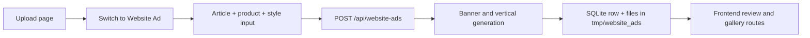

# Website Ads Feature

## Purpose

CAFAI now includes a static website-ad lane alongside the original video-ad workflow.

This feature is built for article-driven creative generation:

- take article context from a headline and body
- combine that context with product information
- generate a horizontal banner and a vertical sidebar ad
- expose those assets in the frontend and through backend asset routes

This document describes the implementation that exists in code today.

## Current Scope

Shipped now:

- upload-page toggle between `Video Ad` and `Website Ad`
- website ad creation with saved products or inline product input
- synchronous backend generation
- SQLite persistence for website ad jobs
- local file storage for generated assets
- gallery/showcase pages in the frontend
- three static injected placement previews for demo storytelling

Not shipped yet:

- URL scraping or automatic article extraction
- async website-ad worker execution
- variant selection workflows
- ZIP export bundles
- live DOM injection into third-party sites

## User Flow

Detailed flow:

1. the operator opens the upload page
2. the operator switches from `Video Ad` to `Website Ad`
3. the operator either:
   - selects an existing product, or
   - enters `product_name` and `product_description`
4. the operator provides:
   - `article_headline`
   - `article_body`
   - `brand_style`
5. the frontend sends the payload to `POST /api/website-ads`
6. the backend generates a banner and a vertical ad
7. the frontend shows the result and links the user to the website ads showcase

## Frontend Entry Points

The feature currently appears in several places:

- `frontend/src/pages/UploadPage.tsx`
  - real website-ad generation form
- `frontend/src/pages/WebsiteAdsPage.tsx`
  - dedicated website-ad page
- `frontend/src/pages/HomePage.tsx`
  - website-ad proof block
- `frontend/src/pages/ResultsPage.tsx`
  - website-ad examples added on top of the existing gallery flow
- `frontend/src/components/WebsiteAdsShowcase.tsx`
  - shared showcase component for the static examples
- `frontend/src/content/websiteAdsContent.ts`
  - content model for the 3 showcase examples

## Backend Flow

The website-ad backend is intentionally small and synchronous.

### Request handling

`backend/internal/api/website_ads_handler.go` accepts:

- `POST /api/website-ads`
- `GET /api/website-ads`
- `GET /api/website-ads/{job_id}`
- `GET /api/website-ads/{job_id}/assets/banner`
- `GET /api/website-ads/{job_id}/assets/vertical`

The create handler accepts:

- `product_id`
- `product_name`
- `product_description`
- `article_headline`
- `article_body`
- `brand_style`

### Service orchestration

`backend/internal/services/website_ad_service.go` performs the core work:

1. validate and normalize the request
2. resolve product details when `product_id` is used
3. build a base prompt from article and product context
4. call the image provider twice:
   - banner prompt at `1200x628`
   - vertical prompt at `300x600`
5. save files to the local website-ads directory
6. update the SQLite job row with status and asset paths

### Image generation provider

`backend/internal/services/website_ads_image_client.go` currently uses Hugging Face routed inference.

Defaults:

- base URL: `https://router.huggingface.co/hf-inference/models`
- model: `stabilityai/stable-diffusion-xl-base-1.0`

Required environment variable:

- `HUGGINGFACE_API_TOKEN`

Optional overrides:

- `HUGGINGFACE_BASE_URL`
- `HUGGINGFACE_IMAGE_MODEL`
- `HUGGINGFACE_REQUEST_TIMEOUT`

## Prompt Strategy

The prompt is built from:

- article headline
- trimmed article body
- product name
- product description
- chosen brand style

The service also adds quality and output constraints such as:

- premium and vibrant composition
- product clearly visible
- no readable text
- no watermark
- no collage or split-screen

Then the service appends a layout instruction for each format:

- horizontal web banner layout
- tall vertical sidebar ad layout

## Storage

### Database

Website ad jobs are stored in SQLite through:

- `backend/internal/db/website_ads.go`
- migration `backend/scripts/migrations/003_website_ads_schema.sql`

Each job stores:

- product references or inline product information
- article context
- visual style
- prompt
- status
- banner image path
- vertical image path
- timestamps

### Filesystem

Generated files are written to:

- `tmp/website_ads`

The backend then serves those files through asset routes instead of exposing the folder directly through the frontend.

## Demo Assets vs Live Generation

There are two different kinds of website-ad assets in this repo.

### Live generated assets

These are created by the backend at runtime and stored in:

- `tmp/website_ads`

### Static showcase assets

These are committed demo assets stored in:

- `frontend/public/website-ads`

They exist so the product can show believable placement previews even when live third-party site injection is not practical.

## Placement Preview Strategy

The 3 showcase examples are not live embedded third-party pages.

Instead, the repo uses captured page screenshots with injected ad placements to demonstrate:

- banner placement
- right-rail vertical placement
- how article context could shape ad creative

This is an intentional demo compromise because many real publishers block iframe embedding or automated browser access.

## Failure Modes

Common website-ad failure cases:

- missing `HUGGINGFACE_API_TOKEN`
- provider quota or rate limit errors
- invalid article/product input
- local file write failures

Error behavior:

- the backend returns structured API errors
- failed generations mark the website-ad job as failed
- no partial success is exposed as completed if one of the two formats fails

## Quick Test Path

1. start the backend
2. start the frontend
3. open the upload page
4. switch to `Website Ad`
5. enter:
   - a product
   - article headline
   - article body
   - style
6. submit
7. confirm the result shows:
   - a banner image
   - a vertical image
8. open the website ads page and compare with the static showcase examples

## Related Files

- `backend/internal/api/website_ads_handler.go`
- `backend/internal/services/website_ad_service.go`
- `backend/internal/services/website_ads_image_client.go`
- `backend/internal/db/website_ads.go`
- `backend/scripts/migrations/003_website_ads_schema.sql`
- `frontend/src/pages/UploadPage.tsx`
- `frontend/src/pages/WebsiteAdsPage.tsx`
- `frontend/src/components/WebsiteAdsShowcase.tsx`
- `frontend/src/content/websiteAdsContent.ts`
